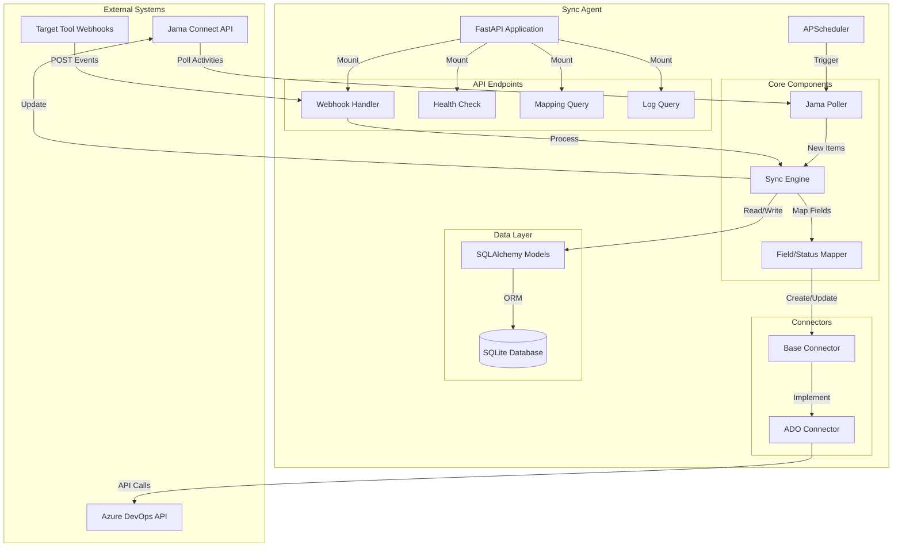

# Design Document

## Overview

The Jama Connect Agentic Sync Layer is a Python-based service that provides bidirectional synchronization between Jama Connect (requirements management) and external ticket management tools (Azure DevOps, GitLab, Jira). The system operates as a standalone FastAPI application with scheduled polling and webhook reception capabilities.

The architecture follows a modular design with clear separation of concerns:
- **Polling subsystem**: Monitors Jama Connect for changes via scheduled API calls
- **Webhook subsystem**: Receives real-time notifications from target tools
- **Sync engine**: Orchestrates bidirectional synchronization with conflict detection
- **Connector layer**: Provides abstraction for multiple target tool integrations
- **Persistence layer**: Maintains sync mappings and immutable audit logs

The system is designed for regulated environments requiring full audit trails (FDA 21 CFR Part 11 compliance) and deterministic sync behavior without AI/ML components in V0.

## Architecture

### High-Level Architecture Diagram



### Component Interaction Flow

**Jama → Target Tool Flow:**
1. APScheduler triggers Poller every 60 seconds
2. Poller queries Jama activities API for configured project
3. Poller identifies new/updated items and passes to Sync Engine
4. Sync Engine checks SyncMapping table for existing mappings
5. For new items, Engine uses Mapper to transform Jama fields
6. Engine calls appropriate Connector to create target tool ticket
7. Connector returns target item ID and URL
8. Engine stores mapping in SyncMapping table
9. Engine logs action to ActionLog table

**Target Tool → Jama Flow:**
1. Target tool sends webhook to POST /webhooks/{tool_name}
2. Webhook handler validates and parses payload
3. Handler looks up mapping by target_item_id
4. Handler passes update to Sync Engine
5. Engine uses Mapper to transform target tool status to Jama status
6. Engine calls Jama client to update item
7. Engine updates last_synced_at in mapping
8. Engine logs action to ActionLog table

**Conflict Detection Flow:**
1. Engine detects update from one side
2. Engine checks last_synced_at timestamp
3. Engine queries other side for last_modified timestamp
4. If both modified since last sync, flag as conflict
5. Set sync_status to "conflict" in mapping
6. Log conflict details to ActionLog
7. Skip automatic sync until manual resolution

## Components and Interfaces

### 1. Configuration Module (`config.py`)

**Purpose**: Load and validate YAML configuration using Pydantic models.

**Classes**:
- `JamaConfig`: Jama connection settings (base_url, username, password, project_id)
- `TargetToolConfig`: Target tool connection settings (tool_type, base_url, credentials, project_id)
- `StatusMapping`: Bidirectional status mappings (jama_status, target_status)
- `FieldMapping`: Field name mappings between systems
- `SyncConfig`: Sync behavior settings (polling_interval, sync_direction)
- `AppConfig`: Root configuration model combining all settings

**Key Methods**:
- `load_config(path: str) -> AppConfig`: Load and validate YAML file
- `get_status_mapping(source: str, status: str) -> str`: Resolve status mapping
- `get_field_mapping(source: str, field: str) -> str`: Resolve field mapping

**Configuration Schema**:
```yaml
jama:
  base_url: "https://jama.example.com"
  username: "sync_agent"
  password: "${JAMA_PASSWORD}"  # Environment variable substitution
  project_id: 12345

target_tool:
  tool_type: "azure_devops"
  base_url: "https://dev.azure.com/org"
  pat: "${ADO_PAT}"
  project: "MyProject"
  
sync:
  polling_interval: 60
  direction: "bidirectional"  # jama_to_target | target_to_jama | bidirectional
  
status_mappings:
  - jama: "Draft"
    target: "New"
  - jama: "Approved"
    target: "Active"
  - jama: "Implemented"
    target: "Resolved"
  - jama: "Verified"
    target: "Closed"
    
field_mappings:
  name: "title"
  description: "description"
  priority: "priority"
  status: "state"
```

### 2. Database Module (`database.py`)

**Purpose**: SQLAlchemy engine setup, session management, and table initialization.

**Functions**:
- `get_engine() -> Engine`: Create SQLAlchemy engine for SQLite
- `init_db() -> None`: Create all tables if they don't exist
- `get_session() -> Session`: Dependency injection for database sessions

**Database Schema**:
```sql
CREATE TABLE sync_mapping (
    id INTEGER PRIMARY KEY AUTOINCREMENT,
    jama_item_id INTEGER NOT NULL,
    jama_project_id INTEGER NOT NULL,
    jama_item_type VARCHAR(50) NOT NULL,
    target_tool VARCHAR(50) NOT NULL,
    target_item_id VARCHAR(100) NOT NULL,
    target_item_url TEXT,
    last_synced_at TIMESTAMP NOT NULL,
    sync_status VARCHAR(20) NOT NULL,  -- active, conflict, error
    created_at TIMESTAMP DEFAULT CURRENT_TIMESTAMP,
    UNIQUE(jama_item_id, target_tool)
);

CREATE INDEX idx_jama_item ON sync_mapping(jama_item_id);
CREATE INDEX idx_target_item ON sync_mapping(target_tool, target_item_id);
CREATE INDEX idx_sync_status ON sync_mapping(sync_status);

CREATE TABLE action_log (
    id INTEGER PRIMARY KEY AUTOINCREMENT,
    timestamp TIMESTAMP NOT NULL DEFAULT CURRENT_TIMESTAMP,
    action VARCHAR(50) NOT NULL,  -- create_ticket, update_status, link_items, sync_error
    source_tool VARCHAR(50) NOT NULL,
    source_item_id VARCHAR(100),
    target_tool VARCHAR(50),
    target_item_id VARCHAR(100),
    payload TEXT NOT NULL,  -- JSON
    result VARCHAR(20) NOT NULL,  -- success, failed, conflict
    error_detail TEXT,
    CHECK (action IN ('create_ticket', 'update_status', 'link_items', 'sync_error')),
    CHECK (result IN ('success', 'failed', 'conflict'))
);

CREATE INDEX idx_action_log_timestamp ON action_log(timestamp);
CREATE INDEX idx_action_log_action ON action_log(action);
CREATE INDEX idx_action_log_result ON action_log(result);
```

### 3. Data Models (`models/`)

#### `models/mapping.py`

**SyncMapping Model**:
```python
class SyncMapping(Base):
    __tablename__ = "sync_mapping"
    
    id: Mapped[int] = mapped_column(primary_key=True)
    jama_item_id: Mapped[int] = mapped_column(nullable=False)
    jama_project_id: Mapped[int] = mapped_column(nullable=False)
    jama_item_type: Mapped[str] = mapped_column(String(50), nullable=False)
    target_tool: Mapped[str] = mapped_column(String(50), nullable=False)
    target_item_id: Mapped[str] = mapped_column(String(100), nullable=False)
    target_item_url: Mapped[Optional[str]] = mapped_column(Text)
    last_synced_at: Mapped[datetime] = mapped_column(nullable=False)
    sync_status: Mapped[str] = mapped_column(String(20), nullable=False)
    created_at: Mapped[datetime] = mapped_column(default=datetime.utcnow)
```

#### `models/action_log.py`

**ActionLog Model**:
```python
class ActionLog(Base):
    __tablename__ = "action_log"
    
    id: Mapped[int] = mapped_column(primary_key=True)
    timestamp: Mapped[datetime] = mapped_column(default=datetime.utcnow, nullable=False)
    action: Mapped[str] = mapped_column(String(50), nullable=False)
    source_tool: Mapped[str] = mapped_column(String(50), nullable=False)
    source_item_id: Mapped[Optional[str]] = mapped_column(String(100))
    target_tool: Mapped[Optional[str]] = mapped_column(String(50))
    target_item_id: Mapped[Optional[str]] = mapped_column(String(100))
    payload: Mapped[str] = mapped_column(Text, nullable=False)  # JSON string
    result: Mapped[str] = mapped_column(String(20), nullable=False)
    error_detail: Mapped[Optional[str]] = mapped_column(Text)
    
    # Prevent updates and deletes at application level
    def __setattr__(self, key, value):
        if self.id is not None:
            raise ValueError("ActionLog entries are immutable")
        super().__setattr__(key, value)
```

### 4. Jama Client (`clients/jama_client.py`)

**Purpose**: Wrapper around py-jama-rest-client with rate limiting and error handling.

**JamaClient Class**:
```python
class JamaClient:
    def __init__(self, config: JamaConfig):
        self.client = JamaClient(config.base_url, (config.username, config.password))
        self.rate_limiter = RateLimiter(max_requests=10, time_window=1.0)
        self.project_id = config.project_id
    
    async def get_activities(self, since: datetime) -> List[Activity]:
        """Poll activity stream for project"""
        
    async def get_item(self, item_id: int) -> JamaItem:
        """Get item details with rate limiting"""
        
    async def update_item(self, item_id: int, fields: Dict[str, Any]) -> None:
        """Update item fields with exponential backoff on 429"""
        
    async def _handle_rate_limit(self, response) -> None:
        """Implement exponential backoff for 429 responses"""
```

**Rate Limiting Strategy**:
- Token bucket algorithm: 10 tokens, refill 10/second
- On 429 response: exponential backoff starting at 1s, max 60s
- After max backoff, skip current operation and log warning

### 5. Connector Layer (`clients/connectors/`)

#### `connectors/base.py`

**BaseConnector Abstract Class**:
```python
class BaseConnector(ABC):
    @abstractmethod
    async def create_item(self, fields: Dict[str, Any]) -> CreateItemResult:
        """Create a new work item in target tool"""
        
    @abstractmethod
    async def update_item(self, item_id: str, fields: Dict[str, Any]) -> None:
        """Update existing work item"""
        
    @abstractmethod
    async def get_item(self, item_id: str) -> TargetItem:
        """Retrieve work item details"""
        
    @abstractmethod
    def parse_webhook(self, payload: Dict[str, Any]) -> WebhookEvent:
        """Parse webhook payload into standardized event"""
        
    @abstractmethod
    async def validate_connection(self) -> bool:
        """Test connection to target tool"""
```

**Shared Data Models**:
```python
@dataclass
class CreateItemResult:
    item_id: str
    item_url: str
    created_at: datetime

@dataclass
class TargetItem:
    item_id: str
    title: str
    description: str
    status: str
    priority: str
    last_modified: datetime
    fields: Dict[str, Any]

@dataclass
class WebhookEvent:
    event_type: str  # created, updated, deleted
    item_id: str
    updated_fields: Dict[str, Any]
    timestamp: datetime
```

#### `connectors/azure_devops.py`

**AzureDevOpsConnector Implementation**:
```python
class AzureDevOpsConnector(BaseConnector):
    def __init__(self, config: TargetToolConfig):
        self.base_url = config.base_url
        self.pat = config.pat
        self.project = config.project
        self.client = httpx.AsyncClient(
            headers={"Authorization": f"Basic {self._encode_pat()}"},
            timeout=30.0
        )
    
    async def create_item(self, fields: Dict[str, Any]) -> CreateItemResult:
        """Create work item using Azure DevOps REST API"""
        # POST https://dev.azure.com/{org}/{project}/_apis/wit/workitems/${type}?api-version=7.0
        
    async def update_item(self, item_id: str, fields: Dict[str, Any]) -> None:
        """Update work item using PATCH with JSON Patch format"""
        
    async def get_item(self, item_id: str) -> TargetItem:
        """GET work item details"""
        
    def parse_webhook(self, payload: Dict[str, Any]) -> WebhookEvent:
        """Parse Azure DevOps service hook payload"""
        # Handle workitem.updated, workitem.created events
```

### 6. Sync Engine (`sync/`)

#### `sync/poller.py`

**JamaPoller Class**:
```python
class JamaPoller:
    def __init__(self, jama_client: JamaClient, sync_engine: SyncEngine):
        self.jama_client = jama_client
        self.sync_engine = sync_engine
        self.last_poll_time: Optional[datetime] = None
    
    async def poll(self) -> PollResult:
        """Poll Jama activities and trigger sync for new/updated items"""
        try:
            activities = await self.jama_client.get_activities(
                since=self.last_poll_time or datetime.utcnow() - timedelta(hours=1)
            )
            
            for activity in activities:
                if activity.activity_type in ['ITEM_CREATED', 'ITEM_UPDATED']:
                    await self.sync_engine.process_jama_update(activity)
            
            self.last_poll_time = datetime.utcnow()
            return PollResult(success=True, items_processed=len(activities))
        except Exception as e:
            logger.error(f"Poll failed: {e}")
            return PollResult(success=False, error=str(e))
```

#### `sync/mapper.py`

**FieldMapper Class**:
```python
class FieldMapper:
    def __init__(self, config: AppConfig):
        self.status_mappings = config.status_mappings
        self.field_mappings = config.field_mappings
    
    def map_jama_to_target(self, jama_item: JamaItem) -> Dict[str, Any]:
        """Transform Jama item fields to target tool format"""
        
    def map_target_to_jama(self, target_item: TargetItem) -> Dict[str, Any]:
        """Transform target tool fields to Jama format"""
        
    def map_status(self, source: str, status: str, direction: str) -> str:
        """Map status between systems with direction awareness"""
```

#### `sync/engine.py`

**SyncEngine Class** (Core orchestration logic):
```python
class SyncEngine:
    def __init__(
        self,
        db_session: Session,
        jama_client: JamaClient,
        connector: BaseConnector,
        mapper: FieldMapper,
        config: AppConfig
    ):
        self.db = db_session
        self.jama_client = jama_client
        self.connector = connector
        self.mapper = mapper
        self.config = config
    
    async def process_jama_update(self, activity: Activity) -> None:
        """Handle new or updated Jama item"""
        # Check if mapping exists
        # If new: create target item, store mapping, log action
        # If existing: check for conflicts, update if safe
        
    async def process_target_update(self, event: WebhookEvent) -> None:
        """Handle target tool webhook event"""
        # Look up mapping
        # Check for conflicts
        # Update Jama item if safe
        # Log action
    
    async def detect_conflict(
        self,
        mapping: SyncMapping,
        jama_item: JamaItem,
        target_item: TargetItem
    ) -> bool:
        """Detect if both sides modified since last sync"""
        jama_modified = jama_item.last_modified > mapping.last_synced_at
        target_modified = target_item.last_modified > mapping.last_synced_at
        return jama_modified and target_modified
    
    async def handle_conflict(
        self,
        mapping: SyncMapping,
        jama_item: JamaItem,
        target_item: TargetItem
    ) -> None:
        """Flag conflict and log details"""
        mapping.sync_status = "conflict"
        self.db.commit()
        
        await self.log_action(
            action="sync_error",
            source_tool="both",
            result="conflict",
            payload={
                "jama_state": jama_item.to_dict(),
                "target_state": target_item.to_dict()
            },
            error_detail="Both systems modified since last sync"
        )
    
    async def log_action(
        self,
        action: str,
        source_tool: str,
        result: str,
        payload: Dict[str, Any],
        **kwargs
    ) -> None:
        """Create immutable audit log entry"""
        log_entry = ActionLog(
            action=action,
            source_tool=source_tool,
            result=result,
            payload=json.dumps(payload),
            **kwargs
        )
        self.db.add(log_entry)
        self.db.commit()
```

### 7. API Endpoints (`api/`)

#### `api/webhooks.py`

```python
@router.post("/webhooks/{tool_name}")
async def receive_webhook(
    tool_name: str,
    payload: Dict[str, Any],
    sync_engine: SyncEngine = Depends(get_sync_engine)
):
    """Receive and process webhook from target tool"""
    connector = get_connector(tool_name)
    event = connector.parse_webhook(payload)
    await sync_engine.process_target_update(event)
    return {"status": "processed"}
```

#### `api/health.py`

```python
@router.get("/health")
async def health_check(
    db: Session = Depends(get_session),
    poller: JamaPoller = Depends(get_poller)
):
    """Return system health status"""
    conflict_count = db.query(SyncMapping).filter_by(sync_status="conflict").count()
    error_count = db.query(SyncMapping).filter_by(sync_status="error").count()
    
    return {
        "status": "healthy",
        "last_poll": poller.last_poll_time,
        "conflicts": conflict_count,
        "errors": error_count
    }
```

#### `api/mappings.py`

```python
@router.get("/mappings")
async def list_mappings(
    skip: int = 0,
    limit: int = 100,
    db: Session = Depends(get_session)
):
    """List all sync mappings with pagination"""
    mappings = db.query(SyncMapping).offset(skip).limit(limit).all()
    return {"mappings": [m.to_dict() for m in mappings]}

@router.get("/mappings/{jama_item_id}")
async def get_mapping(jama_item_id: int, db: Session = Depends(get_session)):
    """Get mapping for specific Jama item"""
    mapping = db.query(SyncMapping).filter_by(jama_item_id=jama_item_id).first()
    if not mapping:
        raise HTTPException(status_code=404, detail="Mapping not found")
    return mapping.to_dict()
```

#### `api/logs.py`

```python
@router.get("/logs")
async def query_logs(
    start_date: Optional[datetime] = None,
    end_date: Optional[datetime] = None,
    action: Optional[str] = None,
    result: Optional[str] = None,
    skip: int = 0,
    limit: int = 100,
    db: Session = Depends(get_session)
):
    """Query action logs with filters"""
    query = db.query(ActionLog)
    
    if start_date:
        query = query.filter(ActionLog.timestamp >= start_date)
    if end_date:
        query = query.filter(ActionLog.timestamp <= end_date)
    if action:
        query = query.filter(ActionLog.action == action)
    if result:
        query = query.filter(ActionLog.result == result)
    
    logs = query.order_by(ActionLog.timestamp.desc()).offset(skip).limit(limit).all()
    return {"logs": [log.to_dict() for log in logs]}
```

### 8. Main Application (`main.py`)

```python
from fastapi import FastAPI
from contextlib import asynccontextmanager
from apscheduler.schedulers.asyncio import AsyncIOScheduler

@asynccontextmanager
async def lifespan(app: FastAPI):
    # Startup
    config = load_config("config.yaml")
    init_db()
    
    scheduler = AsyncIOScheduler()
    poller = get_poller()
    scheduler.add_job(
        poller.poll,
        'interval',
        seconds=config.sync.polling_interval
    )
    scheduler.start()
    
    yield
    
    # Shutdown
    scheduler.shutdown()

app = FastAPI(lifespan=lifespan)
app.include_router(webhooks.router)
app.include_router(health.router)
app.include_router(mappings.router)
app.include_router(logs.router)
```

## Data Models

### Jama Item Model
```python
@dataclass
class JamaItem:
    id: int
    project_id: int
    item_type: str
    name: str
    description: str
    status: str
    priority: str
    last_modified: datetime
    fields: Dict[str, Any]
```

### Activity Model
```python
@dataclass
class Activity:
    id: int
    activity_type: str  # ITEM_CREATED, ITEM_UPDATED, etc.
    item_id: int
    timestamp: datetime
    user: str
```

### Configuration Models (Pydantic)
```python
class JamaConfig(BaseModel):
    base_url: str
    username: str
    password: SecretStr
    project_id: int

class TargetToolConfig(BaseModel):
    tool_type: Literal["azure_devops", "gitlab", "jira"]
    base_url: str
    pat: SecretStr
    project: str

class StatusMappingItem(BaseModel):
    jama: str
    target: str

class SyncConfig(BaseModel):
    polling_interval: int = 60
    direction: Literal["jama_to_target", "target_to_jama", "bidirectional"] = "bidirectional"

class AppConfig(BaseModel):
    jama: JamaConfig
    target_tool: TargetToolConfig
    sync: SyncConfig
    status_mappings: List[StatusMappingItem]
    field_mappings: Dict[str, str]
```

## Error Handling

### Rate Limiting Strategy

**Jama API Rate Limits**:
- 10 requests/second with 100-request queue
- Implementation: Token bucket with 10 tokens, refill rate 10/sec
- On 429 response: exponential backoff (1s, 2s, 4s, 8s, 16s, 32s, 60s max)
- After max backoff: log warning, skip operation, continue with next poll cycle

**Error Categories**:
1. **Transient errors** (network, timeout): Retry with exponential backoff
2. **Rate limit errors** (429): Exponential backoff as above
3. **Authentication errors** (401, 403): Log error, mark mapping as "error", alert admin
4. **Not found errors** (404): Log warning, skip operation
5. **Validation errors** (400): Log error with details, mark mapping as "error"
6. **Server errors** (500): Retry once, then log and skip

### Conflict Resolution

**Conflict Detection**:
```python
def is_conflict(mapping: SyncMapping, jama_item: JamaItem, target_item: TargetItem) -> bool:
    jama_modified = jama_item.last_modified > mapping.last_synced_at
    target_modified = target_item.last_modified > mapping.last_synced_at
    return jama_modified and target_modified
```

**Conflict Handling**:
1. Set `sync_status = "conflict"` in mapping
2. Log to ActionLog with both states in payload
3. Skip automatic sync for this mapping
4. Include in health endpoint conflict count
5. Manual resolution required (future: conflict resolution UI)

### Logging Strategy

**Application Logs** (Python logging):
- INFO: Normal operations (poll started, item synced)
- WARNING: Recoverable issues (rate limit hit, retry)
- ERROR: Failed operations (API error, validation failure)
- Log format: `{timestamp} {level} {component} {message} {context}`

**Audit Logs** (ActionLog table):
- Every sync operation logged
- Immutable entries with full payload
- Queryable via API for compliance reporting

## Testing Strategy

### Unit Tests

**Test Coverage Areas**:
1. **Sync Engine** (`test_sync_engine.py`):
   - Test process_jama_update with new item → creates mapping
   - Test process_jama_update with existing item → updates target
   - Test process_target_update → updates Jama
   - Test conflict detection logic
   - Test error handling and logging

2. **Field Mapper** (`test_mapper.py`):
   - Test map_jama_to_target with all field types
   - Test map_target_to_jama with all field types
   - Test status mapping in both directions
   - Test missing field handling
   - Test invalid status handling

3. **Conflict Detection** (`test_conflict_detection.py`):
   - Test no conflict when only Jama modified
   - Test no conflict when only target modified
   - Test conflict when both modified
   - Test conflict logging
   - Test conflict status in mapping

4. **Webhooks** (`test_webhooks.py`):
   - Test webhook parsing for each connector
   - Test webhook processing flow
   - Test invalid webhook handling
   - Test webhook with unknown item ID

**Mocking Strategy**:
- Mock `JamaClient` for all Jama API calls
- Mock `BaseConnector` implementations for target tool calls
- Use in-memory SQLite for database tests
- Mock `httpx.AsyncClient` for HTTP calls

### Integration Tests

**Test Scenarios**:
1. **End-to-end sync flow**:
   - Mock Jama activity with new item
   - Verify target tool create_item called
   - Verify mapping created in database
   - Verify ActionLog entry created

2. **Webhook flow**:
   - POST mock webhook payload
   - Verify Jama update_item called
   - Verify mapping updated
   - Verify ActionLog entry created

3. **Conflict scenario**:
   - Create mapping with old last_synced_at
   - Mock both sides modified
   - Verify conflict detected
   - Verify no updates made
   - Verify conflict logged

**Test Fixtures**:
```python
@pytest.fixture
def mock_jama_client():
    client = Mock(spec=JamaClient)
    client.get_activities.return_value = [...]
    return client

@pytest.fixture
def mock_connector():
    connector = Mock(spec=BaseConnector)
    connector.create_item.return_value = CreateItemResult(...)
    return connector

@pytest.fixture
def test_db():
    engine = create_engine("sqlite:///:memory:")
    init_db(engine)
    return sessionmaker(bind=engine)()
```

### Test Data

**Sample Jama Item**:
```json
{
  "id": 12345,
  "project_id": 100,
  "item_type": "Requirement",
  "name": "User shall be able to login",
  "description": "The system shall provide a login form...",
  "status": "Approved",
  "priority": "High",
  "last_modified": "2026-02-25T10:00:00Z"
}
```

**Sample ADO Webhook**:
```json
{
  "eventType": "workitem.updated",
  "resource": {
    "id": 67890,
    "fields": {
      "System.Title": "User shall be able to login",
      "System.State": "Resolved",
      "System.ChangedDate": "2026-02-25T11:00:00Z"
    }
  }
}
```

## Deployment

### Docker Configuration

**Dockerfile**:
```dockerfile
FROM python:3.11-slim

WORKDIR /app

COPY pyproject.toml .
RUN pip install --no-cache-dir .

COPY src/ ./src/

EXPOSE 8000

CMD ["uvicorn", "src.main:app", "--host", "0.0.0.0", "--port", "8000"]
```

**Docker Compose** (for local development):
```yaml
version: '3.8'
services:
  sync-agent:
    build: .
    ports:
      - "8000:8000"
    volumes:
      - ./config.yaml:/app/config.yaml
      - ./data:/app/data
    environment:
      - JAMA_PASSWORD=${JAMA_PASSWORD}
      - ADO_PAT=${ADO_PAT}
```

### Environment Variables

- `JAMA_PASSWORD`: Jama Connect password
- `ADO_PAT`: Azure DevOps Personal Access Token
- `DATABASE_PATH`: Path to SQLite database file (default: ./data/sync.db)
- `CONFIG_PATH`: Path to config.yaml (default: ./config.yaml)
- `LOG_LEVEL`: Logging level (default: INFO)

### Persistence

**Volume Mounts**:
- `/app/config.yaml`: Configuration file
- `/app/data`: SQLite database directory

**Database Backup**:
- SQLite database should be backed up regularly
- ActionLog table is append-only for compliance
- Consider write-ahead logging (WAL) mode for better concurrency

### Monitoring

**Health Check**:
- Endpoint: `GET /health`
- Docker health check: `curl -f http://localhost:8000/health || exit 1`

**Metrics to Monitor**:
- Last successful poll time
- Number of active mappings
- Number of conflicts
- Number of errors
- API response times
- Database size

## Security Considerations

1. **Credentials Management**:
   - Store passwords/tokens in environment variables
   - Use SecretStr in Pydantic models
   - Never log credentials

2. **Webhook Authentication**:
   - Validate webhook signatures (tool-specific)
   - Use HTTPS for webhook endpoints
   - Rate limit webhook endpoint

3. **Database Security**:
   - Restrict file permissions on SQLite database
   - Consider encryption at rest for sensitive data
   - Regular backups with secure storage

4. **API Security**:
   - Add authentication to management endpoints
   - Rate limit all endpoints
   - Input validation on all parameters

## Future Enhancements (Out of Scope for V0)

1. **Conflict Resolution UI**: Web interface for manual conflict resolution
2. **Multi-project Support**: Sync multiple Jama projects simultaneously
3. **Custom Field Mappings**: UI for configuring field mappings
4. **Metrics Dashboard**: Real-time sync metrics and visualization
5. **AI-Assisted Mapping**: LLM-based field mapping suggestions
6. **Bi-directional Linking**: Create traceability links in both systems
7. **Batch Operations**: Bulk sync for initial setup
8. **Webhook Retry Logic**: Automatic retry for failed webhook deliveries
